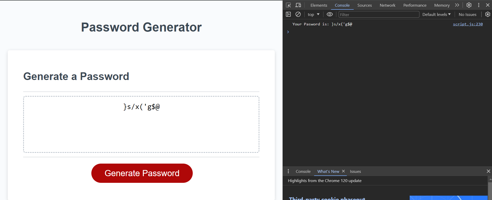

# Password Generator

## Description

### Code Supplied:

Was provided with starter code including the front-end of the password generation application (html and css)

### Task:

To write JavaScript code that generates a password after prompting users for:

- Password length
- Character types
    * Lowercase
    * Uppercase
    * Numeric
    * Special characters

The password should be displayed in the web page.

## Screenshot

Here is a screenshot showing the output once the password generation flow is completed by user:

## Deployed application

[Link to deployed application](https://adam-deb.github.io/Password-Generator/)

## Installation

N/A

## Credits

N/A